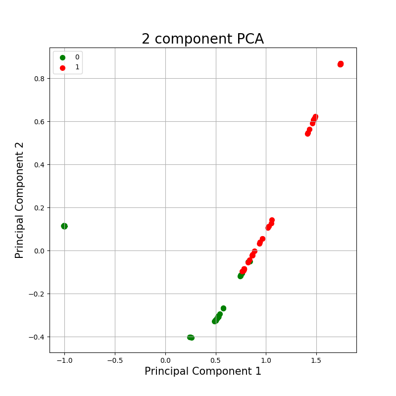

# NIDS-ML
Applying Neural Networks to Detect Hacking Attempts

 

Attacks from hackers can be a serious security threat especially with the prevalence of the internet. Our group has attempted to apply machine learning in building a Network Intrusion Detection System (NIDS).

Our project aims to explore temporal network traffic data to extract relevant features that differentiate network intrusion from normal traffic.

For a practical evaluation of the project, we will attempt to detect and block network traffic while an attack is performed.

Training data is not included in this repository.

This repository is done as part of a group. Other than myself, our members are: Samuel, Huu Dang, Cheng Long and Tan Phan.

# The idea

We attempt to categorize intrusion attempts and normal traffic through the use of an autoencoder and a classifier. Ideally, the autoencoder will perform dimensionality reduction on the packet data, reducing it to the features that matter to differentiate both the types of packets. In addition, we can use an LSTM autoencoder to help exploit the time-based structure of the packets. The LSTM autoencoder will then encode each set of traffic into a single dataset to be classified. We then use the encoded features to perform classification using a simple ANN, classifying it as 1 for malicious and 0 for non-malicious.

# Our Results

Our results are promising. We achieved a training loss of 0.089 on the autoencoder and a testing accuracy of 0.942 with the ANN Classifier. This shows good accuracy in identifying the attack traffic that we used, which were Poodle, Breach and RC4. We can take a look at how well the autoencoder is doing by viewing the PCA Analysis of the autoencoder's results:

As can be seen, the graph shows that the encoded features can clearly be split into the 2 different categories.

The full article on our project can be found here: [NIDS-ML: Report](nids-ml-report.pdf)

## Realtime detection

In addition, we test performing realtime detection in our model by testing it against attacks while they are being executed and seeing if the model can classify and block the attacks before it is fully executed. We found that there is a trade off between the number of packets that the server should wait to receive before sending it for classification. If this number is too low, there is too little information for the neural network to make an accurate classification, if the number is too high, the attack might have already succeeded and completed before it can be blocked. 

## Zero-day dectection

We attempt to use the classifier in order to perform zero-day detection, which represent attacks found by hackers that even the vendors do not know about yet. In order to emulate zero-day attacks, we remove a specific attack from the training data (such as Breach) and then test it solely on Breach attacks and normal traffic. Our results are as follows:

Zero-day Attack | Accuracy | Loss
------------ | ------------- | -------------
Breach | 0.864 | 0.2200
Poodle | 0.821 | 0.2036
RC4 | 0.987 | 0.18945

The model has shown an ability to be able to detect zero-day attacks which were not originally present in the training data. We suspect this may be because subsequent attacks are built on the knowledge of previous attacks and may contain similar characteristics, of which can be encoded by the autoencoder and classified in the same way. 

# Running the code

To perform training and testing, run `classifier_train_and_test.py`. Test and training data folders are to be listed in `normal_dirs` (for normal traffic) and `breach_dirs` for attack traffic. There are other variables that should be defined too, such as `b_size` (batch size), `num_of_test_files`, `num_of_val_files` and `limit` (training size = limit - test files - val files).

After training, several other files are created in the same directory. These files are images of the change in loss and accuracy over each epoch, encoded data to be used for PCA analysis and further testing as well as the trained models.

# Running PCA analysis

Code located in the PCA_Analysis folder. The script `create_view.py` should be pretty self-explanatory.

# Zero-day detection

Run `classifier_test.py`, which is basically the training script except it reads the data from the saved files and instead only tests on folders within `normal_dirs` and `breach_dirs`. The final accuracy for the test files will be output.

# Realtime detection

Code is in `realtime_IDS.py`, using the same readings as those in zero-day detection classifier_test, except this time it keeps watch on a folder. Any time a packet appears in the folder, it will then read the packet and detect if it is malicious or not. If it is, it will ssh into a server and drop the IP using iptables to stop the attack.
